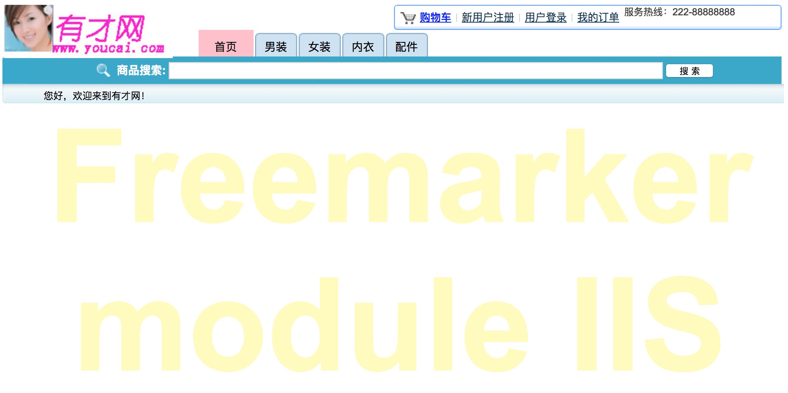
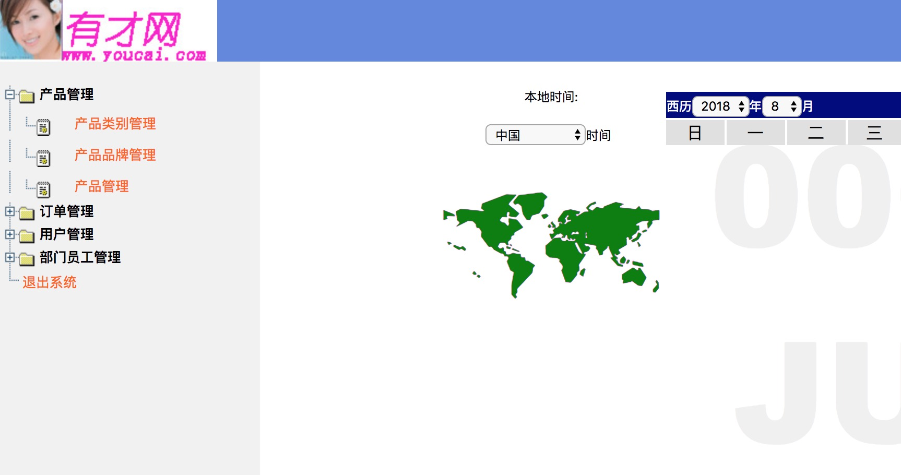

# sshmall

本项目是一小型电子商务网站，于2012年2-8月完成 
技术环境: struts2+spring2.5+hibernate+jsp+jquery, tomcat, jdk6+, mysql, 现已升级spring, 且tomcat请使用8.0以上版本 
mysql: 用户名和密码均为root 
执行: create database youcai; 在tomcat环境下启动项目，会自动建表 
设定context-path: / 
先初始化: localhost:8080/system/init 
后台: localhost:8080/control/center/main 
前台: localhost:8080

